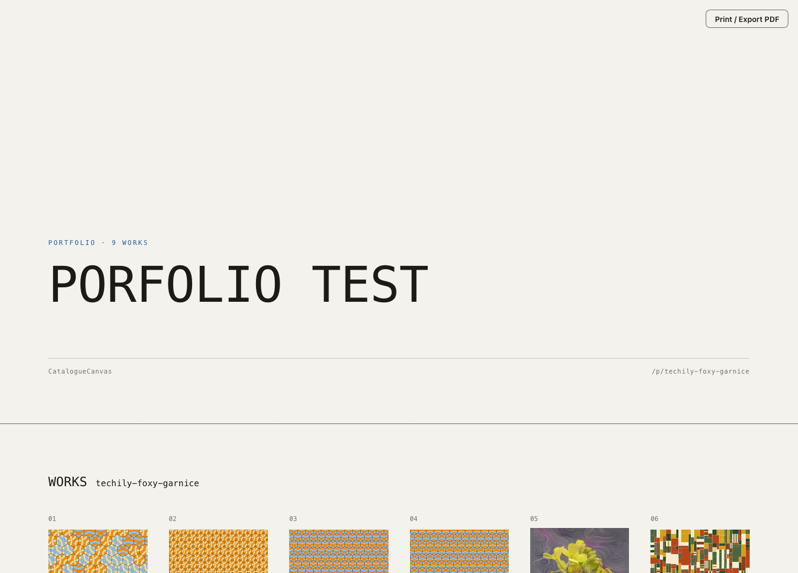
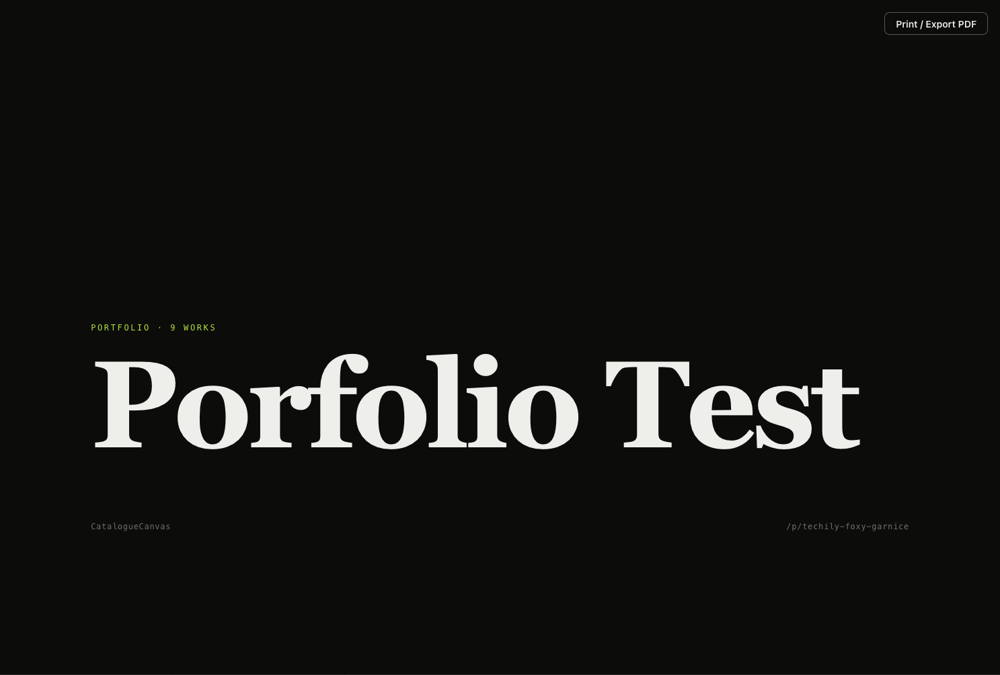
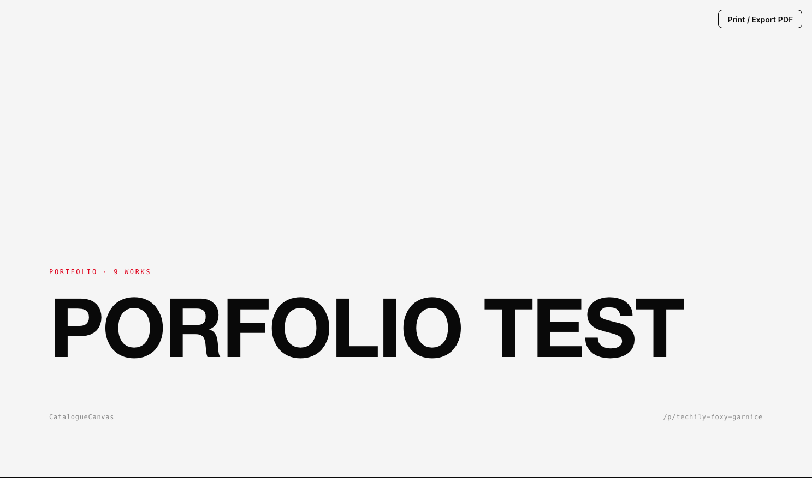
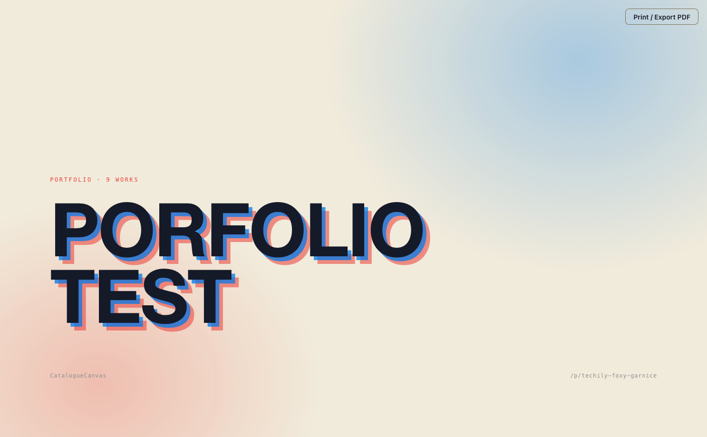

Documentation

# User documentation

Day-to-day use of CatalogueCanvas for an authenticated user (admin session) and for public portfolio viewers.

For deployment and configuration, see [Admin documentation](admins.md).

## Roles you'll encounter

- **Admin** — can upload, edit, organise, configure, and publish.
- **Reader** _(multi-user mode)_ — can view the whole catalogue and download files, but cannot
  modify anything; admin-only menus and controls are hidden.
- **Public viewer** — no login; can only view portfolios marked **Public** via their link.

## Signing in

If the instance runs in **multi-user mode**, sign in with your **username and password**;
otherwise enter the admin password. Your session is held in a secure cookie, and your username
is shown next to the **Log out** button.

!!! warning

    After 5 failed attempts within 5 minutes, login is temporarily blocked.

## What Readers can do

Readers get a **download-only** view of the catalogue. They can download individual files, a
single item as a ZIP, and a multi-select bulk ZIP — without gaining edit access. Editing,
tagging, favouriting, and LLM actions remain admin-only.

## Adding work (upload)

<ol class="steps" markdown>
<li markdown>Click the **upload** button in the top bar.</li>
<li markdown>Select or **drag-and-drop** one or more **ZIP files**.</li>
<li markdown>Pick the destination **library** (defaults to the default library).</li>
<li markdown>Watch the ingestion result — notes may say things like *"SVG compressed (lz4)"* or *"already ingested"*.</li>
</ol>

**What goes in a ZIP?** One ZIP = one item. Include the main image (PNG/JPEG/TIFF/SVG) plus any
supporting files (code, text, JSON, etc.). Optionally include `metadata.json` or `metadata.toml`
and it will be read automatically.

## Activity tray (background work)

Long-running jobs — ZIP uploads, batch LLM descriptions, and single-item descriptions — run in a
collapsible **activity tray** pinned to the bottom-right corner. Start a job and keep working
elsewhere; the tray shows live progress so you don't lose sight of it.

- The tray **persists across page navigation** — start an upload, move to another page, and watch
  it finish.
- Each task carries a **per-item log** with status (pending, in-progress, done, skipped, error)
  and detail messages.
- Clicking a task **takes you back to the page where it started**.
- Running tasks can be **cancelled**; finished ones can be dismissed individually or cleared in
  one click.

!!! note

    Tasks are tracked in the browser session. A full page reload or closing the tab clears the
    tray — the work itself runs per-request on the server.

## Working with an item

<figure markdown>
  
  <figcaption>An item page — preview, files, title/tags/notes, collections, and LLM description</figcaption>
</figure>

On an item's page you can:

- Edit the **title** and **tags**.
- Write **notes in Markdown** — they render formatted; switch to raw mode to edit the Markdown.
- Assign the item to one or more **collections**.
- Toggle **Favourite** (heart icon), if favourites are enabled.
- **Generate an LLM description** (if configured) and apply it to your notes.
- **Navigate** to the previous/next item with the **← / → arrow keys**.
- Open linked files — images and text open inline; other types download.
- **Download** the item as a ZIP, or download all its files.

## Bulk actions

Select multiple items in the catalogue to:

- Add **tags** to all selected
- **Clear notes** on all selected
- **Favourite / unfavourite** in bulk
- **Download** all selected as one ZIP
- Add to / remove from collections

## Searching the catalogue

The search bar reaches **all** of an item's metadata — not just its title, ID, and tags. Search
is backed by a full-text index covering:

- the **title**,
- the **description / note**,
- **tags**, and
- the full contents of each item's uploaded `metadata.json` / `metadata.toml`.

So an item can be found by any value buried in its metadata. Results are **ranked by relevance**,
and **prefix matching** means partial words still match. Search runs on the server, so the whole
catalogue is no longer sent to your browser to filter as you type.

## Collections

- Create, rename, and describe collections.
- Set a **cover item**.
- Delete a collection (the system **Favourites** collection can't be edited or deleted).

## Portfolios (sharing your work)

<ol class="steps" markdown>
<li markdown>Create a portfolio with a **title** and **description**.</li>
<li markdown>Add and order the items it contains.</li>
<li markdown>Choose one of four presentation **themes** (see below).</li>
<li markdown>A **slug** is auto-generated (e.g. `quiet-amber-loom`) — or set your own.</li>
<li markdown>Mark it **Public** to expose it at `/p/<slug>` as a slide-deck presentation.</li>
<li markdown>Share the link — no login needed to view a public portfolio.</li>
<li markdown>Or export it as a static site, ready to upload to a web server[^www].</li>
</ol>

!!! note

    Private portfolios return "not found" to anyone without admin access.

### Themes

Each public portfolio is dressed in one of four presentation themes, chosen per
portfolio in the portfolio editor. A theme carries its own fixed colours and type,
so a published portfolio looks the same regardless of the studio's own
light/dark/accent appearance. Existing portfolios use **Ledger** by default.

- __Ledger__ (default)

    ---

    An archival specimen sheet.

    <figure markdown="span">
      { width="300" }
    </figure>

- __Kinetic__

    ---

    Dark, with an animated capabilities ribbon and a cursor-following thumbnail.

    <figure markdown="span">
      { width="300" }
    </figure>

- __Brutalist__

    ---

    Stark uppercase with hard rules.

    <figure markdown="span">
      { width="300" }
    </figure>

- __Riso__

    ---

    A risograph overprint look.

    <figure markdown="span">
      { width="300" }
    </figure>

### Export as a static site

A public portfolio can be downloaded as a self-contained website. The **Export
static site (.zip)** button (next to **Preview deck**) produces a folder with a
single `index.html` — with the chosen theme baked in — the WebP previews, and a
`README.txt` giving hosting steps.

- The export needs no server and uses only relative paths, so it can be hosted on
  any static host[^www].
- Only the WebP previews are bundled (the same images the public deck shows);
  source attachments are not included.

Two optional controls sit in the export panel, applied at download time:

- **Image quality** (40–95, default 85) — WebP compression for bundled previews. Reducing it shrinks file size at the cost of fidelity.
- **Resize images for screen** — caps the longest edge at a configurable maximum (480–4000 px, default 1280 px), aspect ratio preserved. Useful when you don't want recipients downloading several-megabyte previews.

Neither setting is saved to the portfolio. At the defaults (quality 85, resize off), the output is the same as before. A watermark, if set, is burnt in after resizing and stays proportional.

### Restricting access with a share token

By default a public portfolio is open to anyone with the link. Enabling a **share token** from the portfolio editor restricts it: visitors without a valid token get a 404. Once a recipient visits with the correct token, a cookie is set and they can return without pasting it again.

From the editor you can toggle the token on or off, regenerate it (which invalidates the old one immediately), or copy the token-secured link directly.

!!! note

    Share tokens apply to the live server only. Static exports (`.zip` downloads) are unlisted but do not support token protection.

## Tips & FAQ

- **Re-uploading the same ZIP?** It's deduplicated by content hash — no duplicate is created.
- **Several images in one ZIP?** The preview is chosen by priority (PNG → JPEG → TIFF → SVG); a note explains which was used.
- **Can't find an item?** Search covers titles, notes, tags, and the contents of uploaded `metadata.json` / `metadata.toml` — try a value from the item's metadata.
- **Keyboard:** ← / → move between items on the item page.

[^www]: **Static web server** — There are free services with free tier web server perfect for this role like [codeberg](https://codeberg.page/), [github](https://docs.github.com/en/pages), [tiiny.host](https://tiiny.host/), [cloudflare](https://pages.cloudflare.com/)
